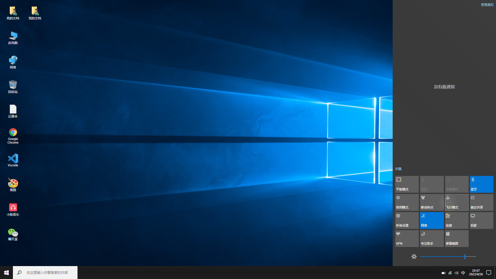
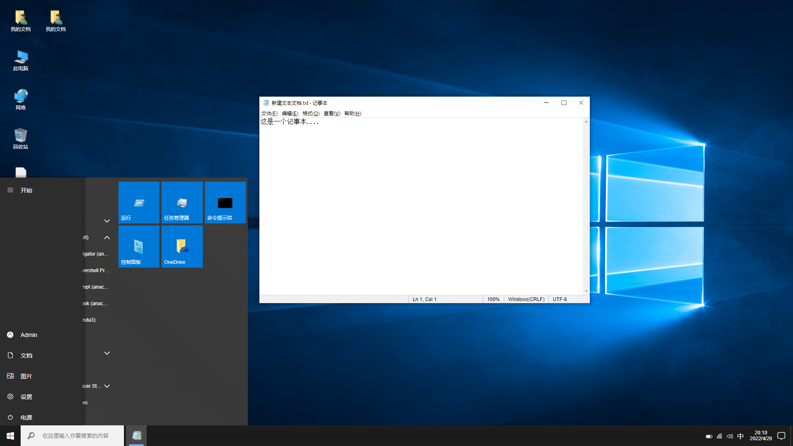
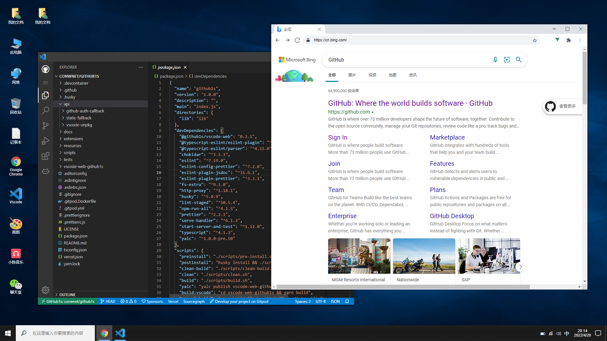
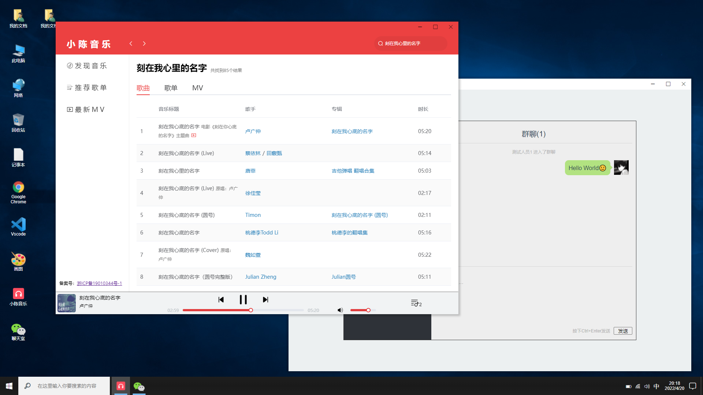
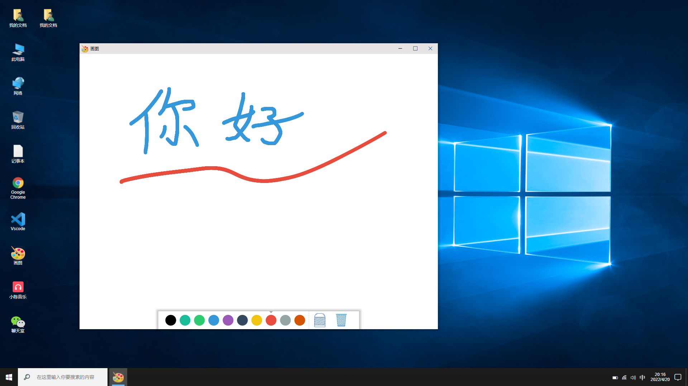
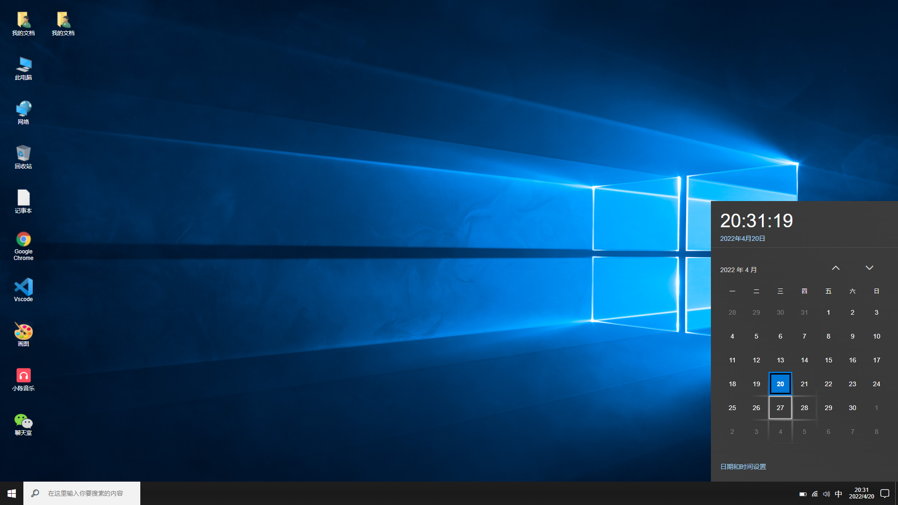
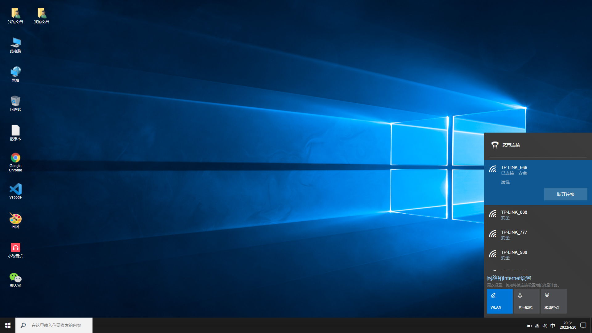

## Windows10 in Vue

 一款 Win10 UI 风格的主页，实现了多种小组件，未来会把自己做的小玩意儿都丢上去。

> 技术栈：Vue2 + Vuex + Less + Element UI

### 页面截图

 

### 内置组件
#### 系统组件
- 日历
- 音量
- 电源
- 网络
- 开始栏
- 通知中心
#### 应用组件
- 小陈音乐：[项目地址](https://github.com/MrRainbowYoo/Music_Player)
- 在线聊天室：[项目地址](https://github.com/MrRainbowYoo/Chat_Room)
- 基于 Canvas 开发的画板
- VSCode
- Chrome 浏览器
- 记事本
- 未完待续.....

### 在线地址
[快来体验一下吧](http://duoduozuikeail.top/webwin10/#/)

### 未来会做的事情
1. 支持用户登录
2. 支持文件保存
3. 添加更多小组件
4. ……